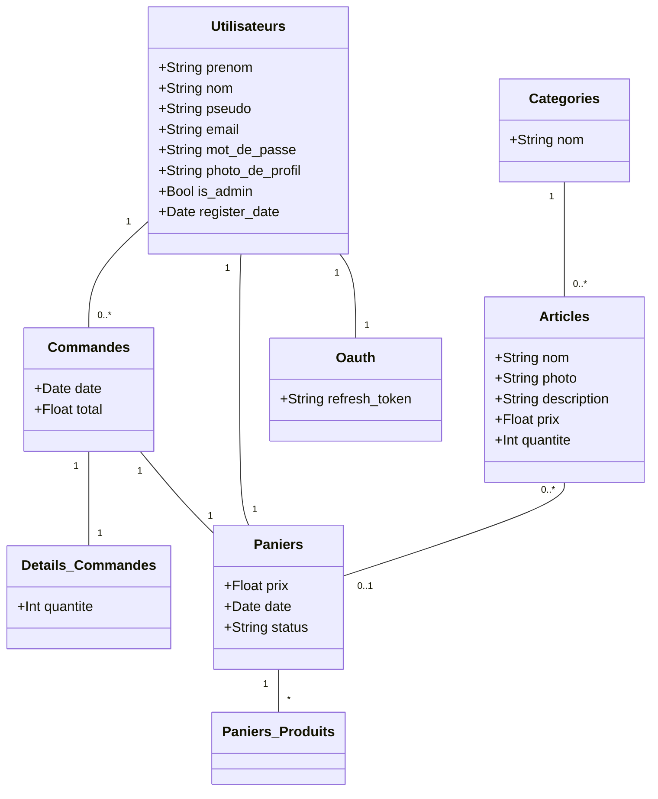
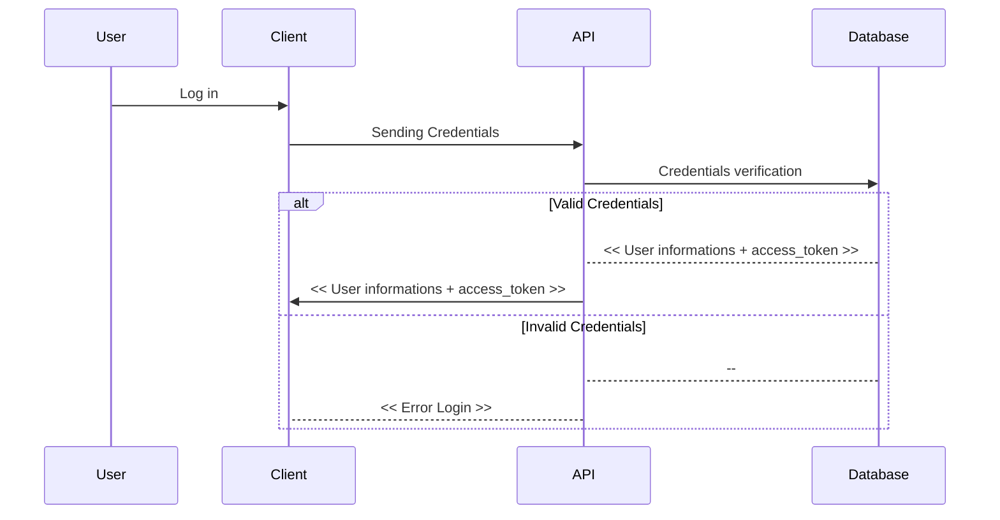

# API - M2L

  

## Table of Contents

1. [Project Overview](#project-overview)
2. [Web Client](#web-client)
3. [Application Protocol Interface](#api)
4. [Database](#database)
5.  [Abstract Protocol Flow](#abstract-protocol-flow)


## <a  id="project-overview"></a>1 Project Overview

For this project, we had to develop a web application made up of three complementary parts: 
- A Web interface
- An API
- A database

## <a  id="web-client"></a>2 Web Client

## <a  id="api"></a>3 Application Protocol Interface

## <a  id="database"></a>4 Database




## <a  id="abstract-protocol-flow"></a>5 Abstract Protocol Flow

> Written with [StackEdit](https://stackedit.io/).²


# Réalisation de l'atelier professionnel (AP3)

## Solution Légère - Association "Maison des Ligues de Lorraine (M2L)

L'entreprise (fictive) Horizon Web a pour objectif le développement d'une solution légère (application web) pour permettre à la Maison des Lignes de Lorraine de proposer à la vente des articles en rapport avec leurs associations

### Frontend - React / Vite

L'interface côté client est réalisée avec la bibliothèque Javascript React (en association avec l'outils Vite) et le framework CSS JoyUI

> [@React/doc](https://react.dev/reference/react)

> [@Vite/doc](https://vitejs.dev/guide/)

> [@joyUI/doc](https://mui.com/joy-ui/getting-started/)

### Backend - Node / Express

L'interface côté serveur est réalisée avec les frameworks Node et Express

> [@Node/doc](https://nodejs.org/en/docs)

> [@Express/doc](https://expressjs.com/fr/guide/routing.html)

### Sécurité - Bcrypt
L'enregistrement et la comparaison des mots de passe se fait avec la bibliothèque Bcrypt
> [@Bcrypt/doc](https://www.npmjs.com/package/bcrypt)

# React + Vite

This template provides a minimal setup to get React working in Vite with HMR and some ESLint rules.
Currently, two official plugins are available:

> [@vitejs/plugin-react-swc](https://github.com/vitejs/vite-plugin-react-swc) uses [SWC](https://swc.rs/) for Fast Refresh ✅

```bash
npm i -D @vitejs/plugin-react-swc
```

```jsx
import { defineConfig } from "vite";
import react from "@vitejs/plugin-react-swc";

export default defineConfig({
   plugins: [react()],
});
```

<p align="center">© Léo Larou-Chalot - BTS SIO option Slam (2ème année)</p>
